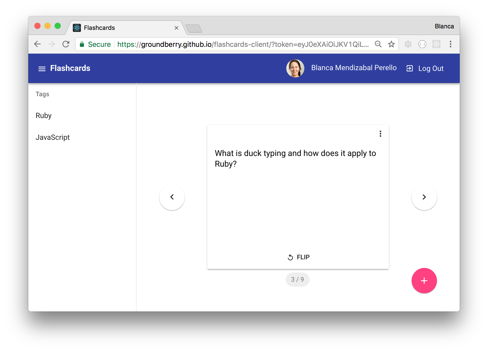
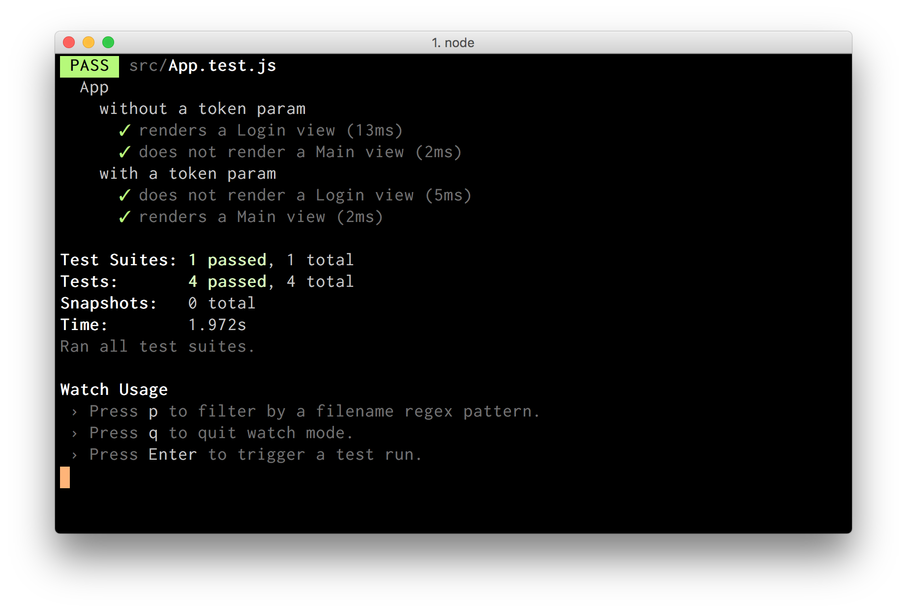

# Flashcards (client)

The goal of this app is helping users on their learning process. Since I graduated from [Makers Academy](http://www.makersacademy.com/) I wanted to put my knowledge to work, so I created Flashcards, a single-page app that helps users study any subject through spaced repetition.

## Functionality

- Authenticate through GitHub.
- Create new flashcards with a question, an answer, and tags.
- Choose between existing tags from a dropdown menu or create a new one.
- Flip a flashcard to see the answer.
- Edit an existing flashcard.
- Delete a flashcard.
- Select flashcards for a particular tag.
- Write markdown, including code snippets that get automatically highlighted.
- Log out.




## Technologies used

The client side of the app is built with [React](https://facebook.github.io/react/). I used [Create React App](https://github.com/facebookincubator/create-react-app) to get it started. For the styling of the UI I used [React Toolbox](http://react-toolbox.com/).

For testing I used [Jest](https://github.com/facebook/jest), and [Enzyme](http://airbnb.io/enzyme/) to test the React components using its shallow and mount rendering.

You can find out more about the [server side](https://github.com/groundberry/flashcards-server).

## Challenges

*Size of the app and flow of information* - As I was implementing new components, the flow of information was getting more complicated. Instead of having one component with too much logic, I split them into smaller, simpler, reusable, stateless components. I decided to keep all the state of the app in the `<App />` parent component, passing information down to child components as props, and having those children communicate with their parent through callbacks.

*Testing* - As the app grew in size and complexity, I realized I was lacking unit tests, which was making it more difficult to introduce changes. When I noticed that I was overwhelmed and losing control of the app, I decided to stop implementing new features and components, and test what I had created so far. Every major step would be tested. This approach really helped me to regain control and implement bug-free logic.

## Future features

*Rating progress* - I would like to add a rating to each flashcard, 🙂 😑 ☹️, so that the user can give feedback on how well the did, and use that information to space them over time.

*Other third-party authentication* - So that users without a GitHub account can also learn using Flashcards.

## Running

Clone this repo:

```
$ git clone https://github.com/groundberry/flashcards-client
```

Install all dependancies:

```
$ npm install
```

Start the server:

```
$ npm start
```

## Testing

Run the tests:

```
$ npm run test
```


